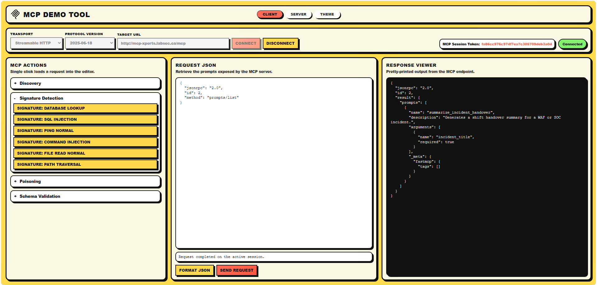

# MCP Demo 🚀

This repository contains a complete MCP security demo with:

- a demo MCP server
- a Web UI client
- a CLI client
- Claude Desktop integration assets
- shell and PowerShell test scripts
- Docker packaging for the server + Web UI



## Repository Layout 📁

```text
mcp-demo/
├── apps/
│   ├── cli/
│   │   └── client.py
│   └── web/
│       ├── run_web_ui.py
│       └── webapp/
├── docker/
│   ├── Dockerfile
│   └── docker-entrypoint.sh
├── docs/
│   ├── CLIENT.md
│   ├── DOCKER.md
│   └── PROMPTS.md
├── integrations/
│   └── claude-desktop/
│       ├── claude_desktop_config.json
│       └── mcp_stdio_proxy.py
├── scripts/
│   ├── mcp_tools_list.ps1
│   └── mcp_tools_list.sh
├── server/
│   ├── files/
│   ├── secrets.txt
│   └── server.py
└── requirements.txt
```

## Install 🛠️

```bash
cd mcp-demo
python3 -m venv .venv
source .venv/bin/activate
pip install --upgrade pip
pip install -r requirements.txt
```

## Makefile Shortcuts ⚡

You can use the provided `Makefile` for the most common actions:

```bash
make run-server
make run-web
make run-cli
make docker-build
make docker-run
```

Examples with overrides:

```bash
make run-server TRANSPORT=sse PROTOCOL_VERSION=2025-03-26
make run-cli TARGET_URL=http://127.0.0.1:7000/sse TRANSPORT=sse PROTOCOL_VERSION=2025-03-26
```

## Run The MCP Server 🖥️

```bash
python server/server.py --transport streamable-http --host 0.0.0.0 --port 7000 --protocol-version 2025-11-25
```

Server options:

- `--transport`: `streamable-http` or `sse`
- `--protocol-version`: `2025-11-25`, `2025-06-18`, `2025-03-26`, `2024-11-05`

## Run The Web UI 🌐

```bash
python apps/web/run_web_ui.py --theme neo-brutalism
```

Open:

```text
http://127.0.0.1:7001
```

Theme options:

- `neo-brutalism` → `Neo Brutalism`
- `glassmorphism` → `Glassmorphism`
- `bootstrap-light` → `Bootstrap Light`
- `glassbox-dark` → `Glassbox Dark`
- `fortinet` → `Fortinet`

Default theme:

- `neo-brutalism`

## Run The CLI Client 💻

```bash
python apps/cli/client.py --target-url http://mcp-xperts.labsec.ca/mcp --transport streamable-http --protocol-version 2025-11-25
```

CLI options:

- `--transport`: `streamable-http` or `sse`
- `--protocol-version`: `2025-11-25`, `2025-06-18`, `2025-03-26`, `2024-11-05`

Examples:

```bash
python apps/cli/client.py --target-url http://127.0.0.1:7000/mcp --transport streamable-http --protocol-version 2025-11-25
python apps/cli/client.py --target-url http://127.0.0.1:7000/sse --transport sse --protocol-version 2025-03-26
```

## Additional Documentation 📚

- Web UI and local usage: [CLIENT.md](docs/CLIENT.md)
- Docker usage: [DOCKER.md](docs/DOCKER.md)
- Prompt examples: [PROMPTS.md](docs/PROMPTS.md)
- Protocol version differences: [PROTOCOL_VERSIONS.md](docs/PROTOCOL_VERSIONS.md)
